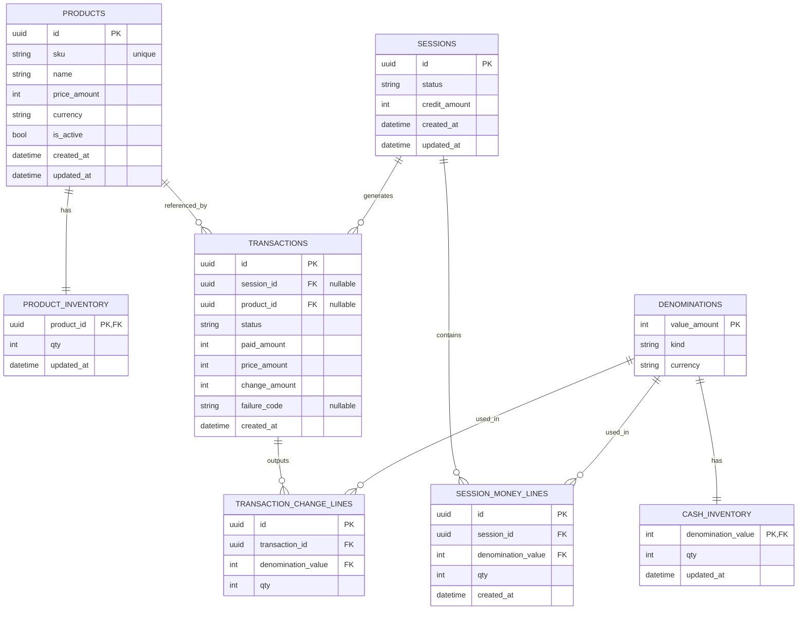

```mermaid
erDiagram
  PRODUCTS ||--|| PRODUCT_INVENTORY : has
  DENOMINATIONS ||--|| CASH_INVENTORY : has

  SESSIONS ||--o{ SESSION_MONEY_LINES : contains
  DENOMINATIONS ||--o{ SESSION_MONEY_LINES : used_in

  PRODUCTS ||--o{ TRANSACTIONS : referenced_by
  SESSIONS ||--o{ TRANSACTIONS : generates

  TRANSACTIONS ||--o{ TRANSACTION_CHANGE_LINES : outputs
  DENOMINATIONS ||--o{ TRANSACTION_CHANGE_LINES : used_in

  PRODUCTS {
    uuid id PK
    string sku "unique"
    string name
    int price_amount
    string currency
    bool is_active
    datetime created_at
    datetime updated_at
  }

  PRODUCT_INVENTORY {
    uuid product_id PK, FK
    int qty
    datetime updated_at
  }

  DENOMINATIONS {
    int value_amount PK
    string kind
    string currency
  }

  CASH_INVENTORY {
    int denomination_value PK, FK
    int qty
    datetime updated_at
  }

  SESSIONS {
    uuid id PK
    string status
    int credit_amount
    datetime created_at
    datetime updated_at
  }

  SESSION_MONEY_LINES {
    uuid id PK
    uuid session_id FK
    int denomination_value FK
    int qty
    datetime created_at
  }

  TRANSACTIONS {
    uuid id PK
    uuid session_id FK "nullable"
    uuid product_id FK "nullable"
    string status
    int paid_amount
    int price_amount
    int change_amount
    string failure_code "nullable"
    datetime created_at
  }

  TRANSACTION_CHANGE_LINES {
    uuid id PK
    uuid transaction_id FK
    int denomination_value FK
    int qty
  }
```